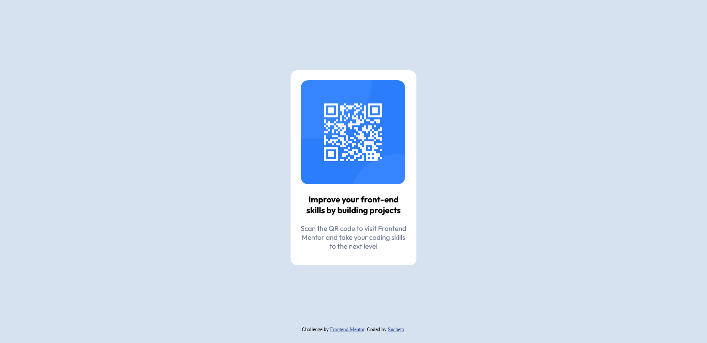

# Frontend Mentor - QR code component solution

This is a solution to the [QR code component challenge on Frontend Mentor](https://www.frontendmentor.io/challenges/qr-code-component-iux_sIO_H). Frontend Mentor challenges help you improve your coding skills by building realistic projects. 

## Table of contents

  - [Overview](#overview)
  - [Screenshot](#screenshot)
  - [Built with](#built-with)
  - [What I learned](#what-i-learned)
  - [Useful resources](#useful-resources)

## Overview
   I was looking for a beginner's level project online as I have pretty basic knowledge of HTML5 and CSS.I had a look at QR component project and thought of giving it a go.I found this project interesting and fun. Doing this project has given me confidence of coding in HTML and CSS along with a chance to further enhance my skills in both.

### Screenshot

### Built with

- HTML5 markup
- CSS custom properties

### What I learned

Positioning QR code component in the middle of the screen was a challenge.After going through you-tube and websites ,I came across CSS-Transform property ,which was helpful for positioning the component in the middle of the screen.Code snippet is as follows:
    position: absolute;
    top: 50%;
    left: 50%;
    transform: translate(-50%, -50%);
    width: 50%;
    height: 50%;

### Useful resources

-(https://www.w3schools.com) - This helped me with syntaxes ,concepts regarding HTML5 and CSS. I really like the simplicity of this website.
-(https://www.freecodecamp.org) - There was a discussion regarding transform property on its forum ,which helped me in applying it here.

